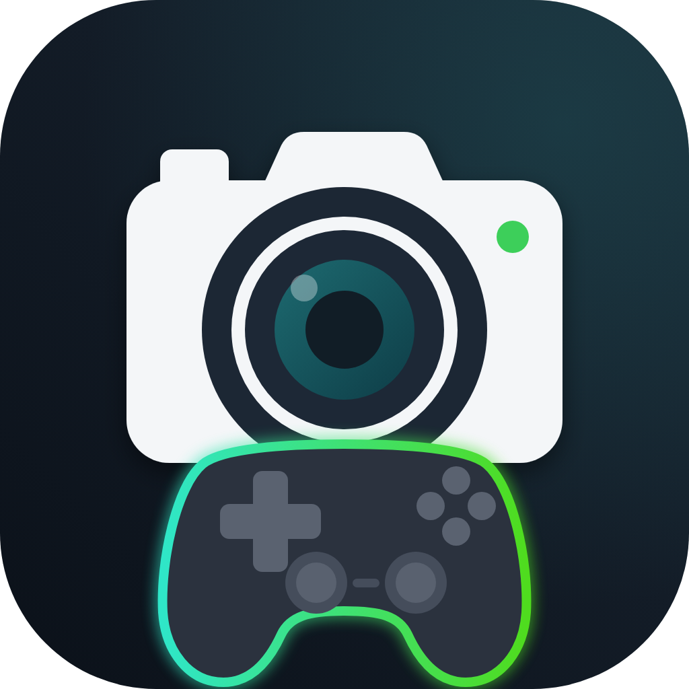
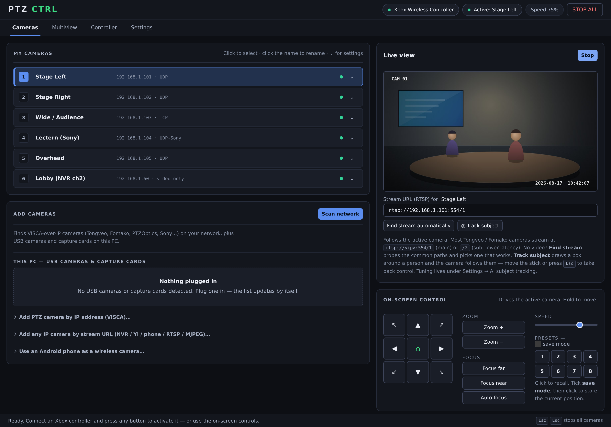
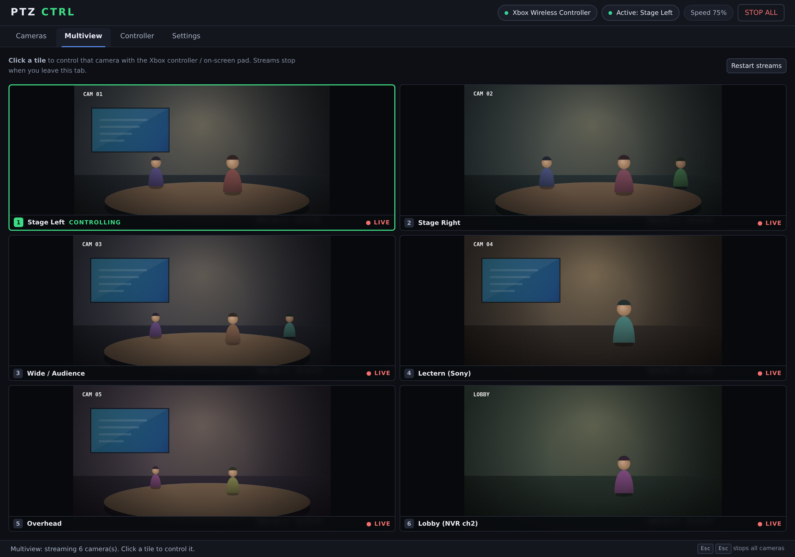
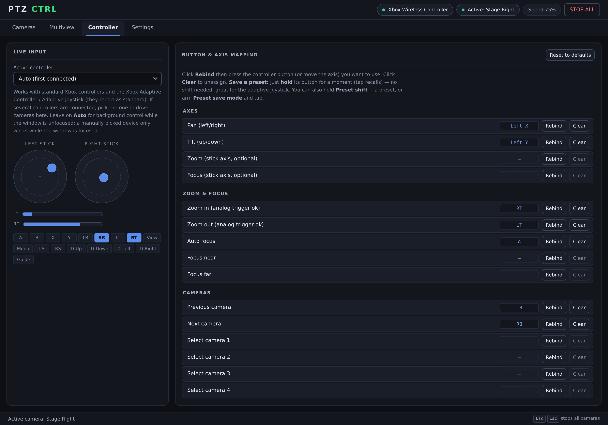
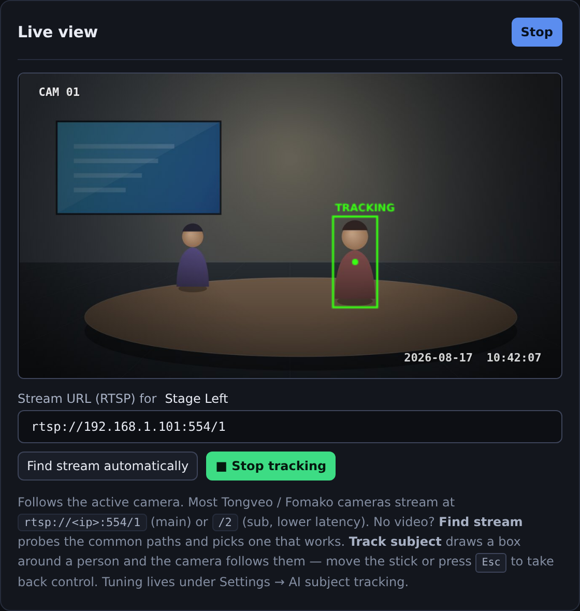
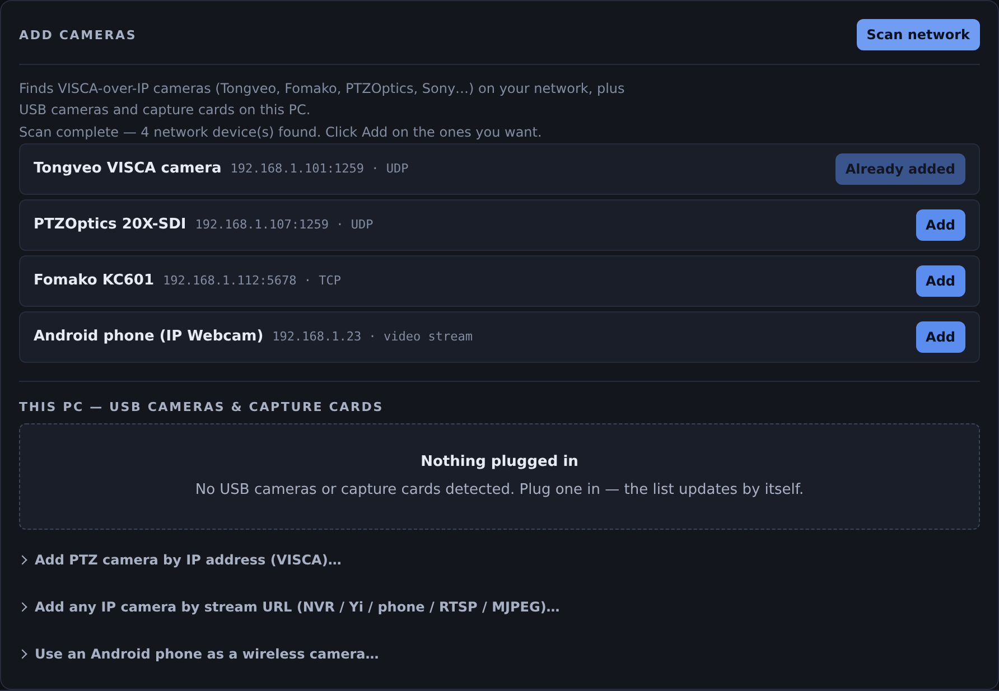

<div align="center">



# PTZ CTRL

**Drive VISCA-over-IP PTZ cameras with an Xbox controller.**
A free desktop replacement for a hardware PTZ controller — multi-camera,
live video, presets, and on-device AI subject tracking.

[](https://github.com/Kryptographer/ptzctrl/actions/workflows/ci.yml)
[](LICENSE)
[](#install)
[](https://www.electronjs.org/)

</div>



---

Plug in an Xbox One controller and drive your cameras like a Fomako or PTZOptics
hardware panel: sticks for pan/tilt, analog triggers for zoom, shoulder buttons
to switch cameras, D-pad for presets. It speaks **VISCA over IP** (UDP 1259,
Sony-framed UDP 52381, TCP 5678), so it works with Tongveo conference cams,
Fomako, PTZOptics, Sony and most other network PTZ cameras — plus USB PTZ
cameras over UVC, capture cards, and any RTSP/MJPEG source for video.

Built for live use: every stop is guaranteed on the wire, lost UDP packets can't
strand a camera mid-pan, and <kbd>Esc</kbd> <kbd>Esc</kbd> halts everything.

## Highlights

- 🎮 **Xbox controller support** — wired or Bluetooth, with every action
  rebindable. The Xbox Adaptive Controller and Adaptive Joystick work as-is.
- 🔍 **One-click discovery** — ONVIF WS-Discovery plus VISCA probes find network
  cameras, and USB cameras and capture cards on this PC, in one scan.
- 🎥 **As many cameras as you like** — switch with LB/RB or bind direct-select
  buttons for cameras 1–8.
- 📺 **Live video and Multiview** — watch the active camera, or a security-wall
  grid of every camera at once. Click a tile to control it.
- 🤖 **AI subject tracking** — draw a box around a person and the camera follows
  them, using a neural vision-transformer tracker that runs fully on-device.
- 💾 **8 presets per camera** — tap a button to recall, hold it to save. No
  two-button chord required.
- 🕹 **Broadcast-grade drive discipline** — anti-chatter hysteresis, braked
  reversals, wire-guaranteed stops and self-healing UDP.
- 🪟 **Runs in the tray, works unfocused** — on Windows the controller is read
  natively via XInput, so cameras keep moving while you're in another app.
- ⌨️ **Fully keyboard operable** — proper ARIA semantics, AA-contrast text, and
  status spelled out in words rather than signalled by colour alone.
- 🛑 **STOP ALL** — one panic button halts motion on every camera.

## Screenshots

<table>
  <tr>
    <td width="50%"><br><em>Multiview — every camera at once; click a tile to control it</em></td>
    <td width="50%"><br><em>Controller — live input plus press-to-bind mapping</em></td>
  </tr>
  <tr>
    <td><br><em>AI subject tracking, fully on-device</em></td>
    <td><br><em>Network scan — click Add on what you want</em></td>
  </tr>
</table>

<sup>Screenshots show the real app driven against simulated camera feeds.</sup>

## Install

**Windows:** double-click **`build.bat`**. It checks for Node.js, installs
dependencies, builds the installer and tells you where it is (the `dist`
folder).

**Any platform**, with [Node.js](https://nodejs.org/) 20 or newer:

```bash
git clone https://github.com/Kryptographer/ptzctrl.git
cd ptzctrl
npm install
npm start          # run it
npm run dist       # or build an installer: NSIS (Windows), DMG (macOS), AppImage (Linux)
```

## Quick start

1. **Connect a camera.** Open the **Cameras** tab and click **Scan network**,
   then **Add** the cameras you want. Not found? Add it by IP — most cameras
   answer VISCA on UDP port 1259.
2. **Watch it.** Press **Start** under Live view. If there's no picture, click
   **Find stream automatically**.
3. **Drive it.** Plug in an Xbox controller and press a button. Left stick pans
   and tilts, triggers zoom, LB/RB switch cameras, the D-pad recalls presets 1–4
   (hold to save).

| Input | Action |
| --- | --- |
| Left stick | Pan / tilt (speed proportional) |
| RT / LT | Zoom in / out (analog — pressure sets speed) |
| LB / RB | Previous / next camera |
| A | Auto focus |
| B | Home position |
| D-pad | Presets 1–4 (tap to recall, hold to save) |
| View / Menu | Speed down / up |
| LS click (hold) | Precision mode |
| <kbd>Esc</kbd> <kbd>Esc</kbd> | STOP ALL cameras |

Everything above can be rebound on the **Controller** tab.

## Supported hardware

| Device | PTZ control | Live video |
| --- | :---: | :---: |
| VISCA-over-IP cameras — Tongveo, Fomako, PTZOptics, Sony… | ✅ | ✅ |
| USB PTZ cameras (UVC pan/tilt/zoom) | ✅ | ✅ |
| USB webcams, HDMI/SDI capture cards | — | ✅ |
| Any RTSP/MJPEG source — NVR channels, Hikvision, Dahua, Yi… | — | ✅ |
| Android phone running *IP Webcam* or similar | — | ✅ |

Details, protocol/port tables and troubleshooting: **[docs/cameras.md](docs/cameras.md)**.

## Documentation

| Guide | What's in it |
| --- | --- |
| **[Cameras](docs/cameras.md)** | Supported hardware, adding cameras, VISCA protocols, stream URLs, troubleshooting |
| **[Controller & control feel](docs/controller.md)** | Default layout, remapping, presets, adaptive controllers, movement tuning, keyboard control |
| **[AI subject tracking](docs/tracking.md)** | How tracking works, its settings, and the optional higher-accuracy model |
| **[Architecture](docs/architecture.md)** | Source layout, the control path, tests, building |

## Contributing

Issues and pull requests are welcome — see **[CONTRIBUTING.md](CONTRIBUTING.md)**.
Run the headless test suite with:

```bash
npm test
```

## License

PTZ CTRL is [MIT](LICENSE) — use it, change it, ship it, sell it, as long as
the copyright notice and licence text travel with it.

Builds also contain third-party software under its own terms:

- The **VitTrack** tracking model is Apache-2.0, from the
  [OpenCV Zoo](https://github.com/opencv/opencv_zoo/tree/main/models/object_tracking_vittrack)
  (see [`src/models/LICENSE`](src/models/LICENSE)).
- The bundled **ffmpeg** binary is **GPL-3.0-or-later**. It is run as a
  separate program, not linked, and the app works with any system ffmpeg
  instead — but if you redistribute an installer containing it, the GPL's
  source-availability obligation comes with it.
- **Electron**, **Chromium**, **ONNX Runtime Web** and **Koffi** ship under
  MIT/BSD terms.

Full details, and how to build without the GPL'd binary:
**[NOTICE.md](NOTICE.md)**.

## Disclaimer

PTZ CTRL is provided **as is**, without warranty of any kind, express or
implied — see the [licence](LICENSE) for the full text. It drives physical
hardware over a network, and cameras, firmware and networks all vary: test
your setup before you rely on it. It is not designed or certified for
safety-critical use, and the authors and contributors accept no liability for
missed shots, damaged equipment or any other loss arising from its use.

PTZ CTRL is an independent project and is not affiliated with or endorsed by
Microsoft, Sony, PTZOptics, Fomako, Tongveo or any other manufacturer;
trademarks are used only to describe compatibility
(see [NOTICE.md](NOTICE.md#trademarks)).
