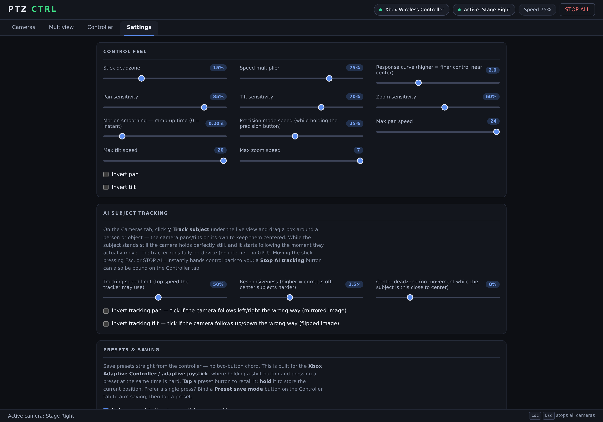

# Controller & control feel

- [Default layout](#default-layout)
- [Remapping](#remapping)
- [Presets](#presets)
- [Xbox Adaptive Controller](#xbox-adaptive-controller)
- [Control feel settings](#control-feel-settings)
- [How movement behaves](#how-movement-behaves)
- [Keyboard control](#keyboard-control)
- [Background control](#background-control)

## Default layout

| Input | Action |
| --- | --- |
| Left stick | Pan / tilt (speed proportional) |
| RT / LT | Zoom in / out (analog — pressure sets speed) |
| LB / RB | Previous / next camera |
| A | Auto focus |
| B | Home position |
| X (hold) | Preset shift — hold + a preset to save |
| D-pad | Presets 1–4 (tap to recall, hold to save) |
| View / Menu | Speed down / up |
| LS click (hold) | Precision mode — ultra-fine movement |

## Remapping

Every action — pan/tilt/zoom/focus axes, presets 1–8, camera switching and
direct camera select 1–8, home, auto focus, OSD menu, speed up/down, precision
mode, stop AI tracking — can be rebound on the **Controller** tab. Click
*Rebind*, then press the button or move the axis you want; click *Clear* to
unassign. *Reset to defaults* asks for confirmation first.

The tab also shows live input: both sticks, both analog triggers and every
button light up as you press them, which makes it obvious what a given
controller actually reports.

## Presets

Eight preset slots per camera, reachable three ways:

- **Tap to recall, hold to save** (default). No shift chord needed — the four
  buttons on an adaptive joystick each become a full preset.
- **Preset shift + preset** — the classic chord, still supported.
- **Preset save mode** — bind a button that arms saving, then tap a preset.
  The on-screen *save mode* tick box is the same switch.

In the UI, presets are clickable: click to recall, Shift-click (or tick *save
mode* first) to store. A saved preset gives a short controller rumble as
confirmation on pads that support it.

Recalls land cleanly. A recall first stops whatever was driving the camera
(stick, zoom trigger, AI tracking), then waits for the sticks and triggers to
return to neutral before driving again — so recalling mid-move can't leave the
camera drifting off the position it was just sent to.

## Xbox Adaptive Controller

The Xbox Adaptive Controller and Adaptive Joystick report as standard
controllers and work as-is. Two things are designed around them:

- **Hold-to-save presets**, so no two-button chord is ever required.
- **A device picker** on the Controller tab, for when several controllers are
  connected. Leave it on *Auto* for background control while the window is
  unfocused; a manually picked device only updates while the window is focused.

## Control feel settings

All of these live under **Settings → Control feel** and persist between runs.

| Setting | What it does |
| --- | --- |
| Stick deadzone | Radial deadzone around centre, with hysteresis so a resting hand never chatters the camera. |
| Speed multiplier | Master speed, also bound to the speed up/down buttons. |
| Response curve | Exponent applied to stick deflection — higher means finer control near centre. |
| Pan / tilt / zoom sensitivity | Per-axis scalers on top of the max speeds. |
| Motion smoothing (ramp-up time) | Seconds from 0 to full speed. Slowing down and stopping runs 3× faster for safety. |
| Precision mode speed | How far speeds scale down while the precision button is held. |
| Max pan / tilt / zoom speed | Hard ceilings, in the camera's own speed units. |
| Invert pan / invert tilt | Flip stick direction. |

## How movement behaves

- **True to the stick.** The pan/tilt stick is shaped as a vector: the
  deadzone is radial and the response curve applies to total deflection, so
  the camera moves exactly where the stick points. Diagonals stay diagonal at
  every speed, pushes within ~10° of an axis map to a perfectly level pan or
  straight tilt (with the cross-axis fading back in smoothly, no snap
  boundary), and left/right and up/down are exactly symmetric.
- **Reversals are braked.** A direction reversal always lands an explicit stop
  on the wire — held long enough to survive command pacing — before the camera
  spins up the other way.
- **Lost packets can't strand a camera.** Velocity commands ride on lossy UDP,
  so the current drive is re-sent every 300 ms while moving and every stop is
  sent twice.
- **Camera switching hands over cleanly.** Switching mid-move sends an explicit
  stop to the old camera; the new one picks up the held stick immediately.
- **Speed steps have hysteresis**, so stick noise and hand tremor never chatter
  the camera between speeds or between moving and stopped.

## Keyboard control

Every control is reachable and usable from the keyboard alone.

| Keys | Action |
| --- | --- |
| <kbd>Ctrl</kbd>+<kbd>1</kbd>…<kbd>4</kbd> | Jump to Cameras, Multiview, Controller, Settings |
| <kbd>←</kbd> <kbd>→</kbd> | Move along the tab strip |
| <kbd>↑</kbd> <kbd>↓</kbd> | Change the active camera in the camera list |
| <kbd>Esc</kbd> | Cancel a rebind, or stop AI tracking |
| <kbd>Esc</kbd> <kbd>Esc</kbd> | STOP ALL cameras |

Multiview tiles are real buttons, the interface carries proper
tab/listbox/pressed semantics and AA-contrast text, and status, health and
mode changes are announced and always spelled out in words — never signalled
by colour alone. Destructive steps (removing a camera, resetting the mapping)
confirm inline and back out on <kbd>Esc</kbd>.

## Background control

Closing the window keeps PTZ CTRL running in the system tray, so the
controller keeps driving cameras with no window open. The tray menu offers
*Open*, *STOP ALL cameras* and *Quit*; launching the app again brings the
existing window back.

On **Windows**, the controller is read natively via XInput in the app's
background process, so input keeps flowing even when the window is not
focused — click into a browser or your slides and the sticks still move the
camera. On macOS and Linux, control works while the window is focused.
